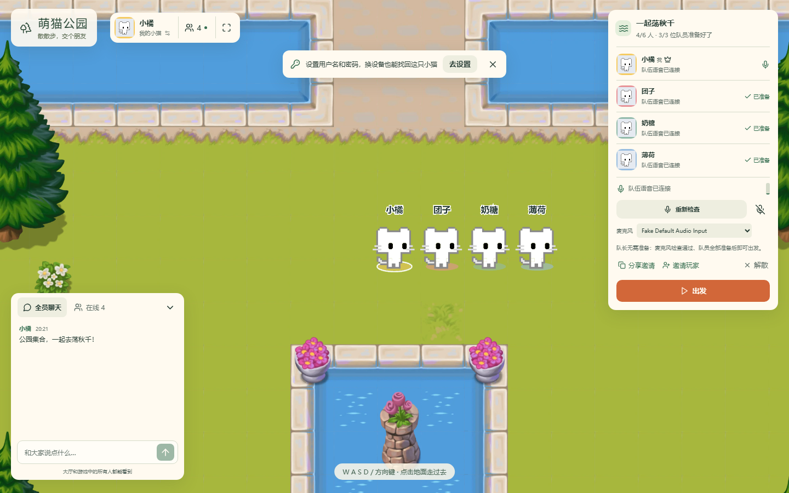
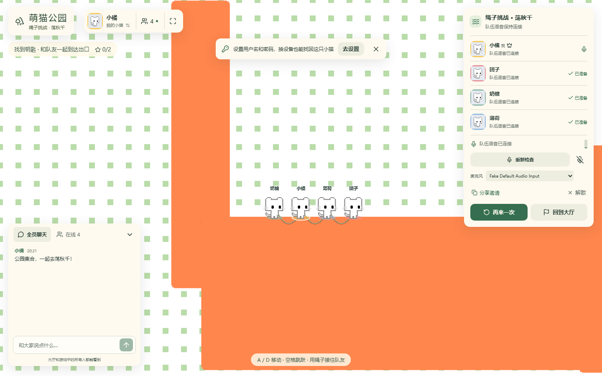
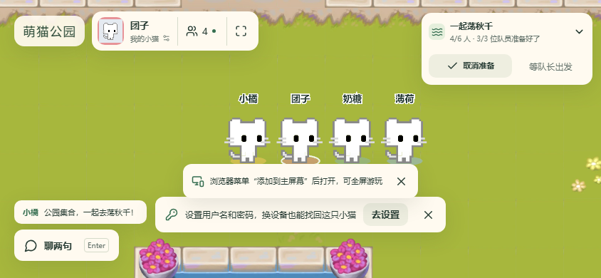
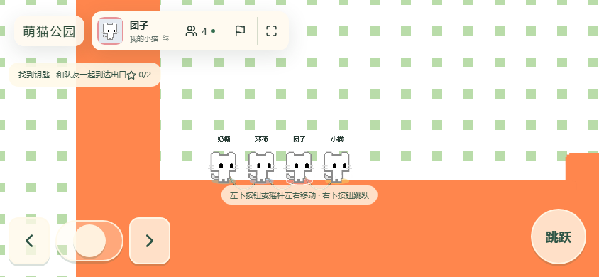

# 萌猫公园网页版

支持电脑和手机浏览器的多人协作游戏：在公共大厅散步聊天，邀请朋友组队，通过队内语音配合，一起挑战“绳子挑战 · 荡秋千”。

当前已实现浏览器账号、角色与配色、公共聊天、组队邀请、LiveKit 队内语音，以及带绳索物理和位置预测的多人关卡。首版仅包含大厅与“荡秋千”单地图，物理手感仍在校准。

## 游戏截图

四只不同配色的小猫在同一实例中组队；游戏截图已实际开局。手机图使用 844 × 390 横屏触摸视口，电脑图使用 1440 × 900 视口，均由 Chromium 实际渲染。

<table>
  <tr><th>电脑 · 大厅</th><th>电脑 · 游戏中</th></tr>
  <tr>
    <td></td>
    <td></td>
  </tr>
  <tr><th>手机 · 大厅</th><th>手机 · 游戏中</th></tr>
  <tr>
    <td align="center"></td>
    <td align="center"></td>
  </tr>
</table>

## 本地运行

需要 **Node.js 24+** 和本地素材包。**公开仓库不包含游戏素材或运行图集，单独克隆源码不能直接启动完整游戏。** 素材接入方式见 [开发与本地运行](./docs/development.md#素材打包)，使用前需自行取得相应素材的合法使用权限。

具备素材包后运行：

```sh
npm ci
npm start
```

默认打开 `http://localhost:3000`。`npm start` 生成运行素材、构建前端，并启动本地 LiveKit 和游戏服务；`npm run start:dev` 启用前端热更新。首次启动会生成本地配置和随机语音密钥。

手机只支持横屏，竖屏时会提示把手机横过来；建议添加到主屏幕或安装为应用后从桌面打开，没有地址栏和状态栏。电脑使用 WASD / 方向键移动，也可点击地面走过去，关卡中用空格跳跃；手机在大厅点一下地面即可走过去，按住拖动则像摇杆一样移动；关卡中左下方是左右按钮和中间的左右摇杆（可点按钮，也可按住摇杆拖动），右下方是跳跃按钮。至少两人组队，队员全部准备、队长麦克风检查通过后由队长开局；准备原则上要求通过麦克风与语音检查，设备确实无法使用时可确认后不开麦准备，队友会看到其未开麦。

首次进入自动创建账号，可随时在设置里补充用户名和密码，之后可用用户名或用户 ID 登录。离线玩家的小猫会变灰留在大厅原地，头顶显示多久前在线。

手机远程访问需要 HTTPS，以及浏览器可达的 LiveKit WSS 与 WebRTC 媒体端口。完整配置、构建和验证方法见 [开发与本地运行](./docs/development.md)，部署示例见 [部署说明](./deploy/README.md)。

## 技术与文档

前端使用 React、TypeScript 和 PixiJS；服务端使用 Node.js、Colyseus 与 SQLite；物理由 Rapier 2D 实现，队伍语音使用 LiveKit。

- [业务术语](./CONTEXT.md)：大厅、队伍、对局和频道。
- [网络协议](./shared/protocol.ts)：客户端与服务端的消息契约。
- [游戏行为与验证边界](./docs/game-behavior.md)：已实现规则及待校准行为。

## 许可证与素材

本项目原创源码采用 [MIT License](./LICENSE)，版权人为 shellus。

游戏图像、角色、音频、字体、地图等第三方内容及截图中包含的这些内容不属于 MIT 授权范围，其权利归原权利人所有；详见 [第三方内容说明](./THIRD_PARTY_NOTICES.md)。

Git 仅跟踪应用源码、测试、公开文档与展示截图；素材包、运行图集、账号数据和私有配置不纳入仓库。

## 后续工作

见 [待办](./todo.md)。
